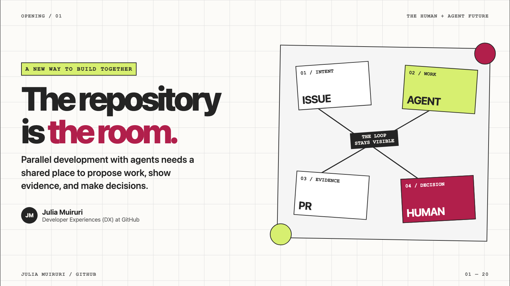
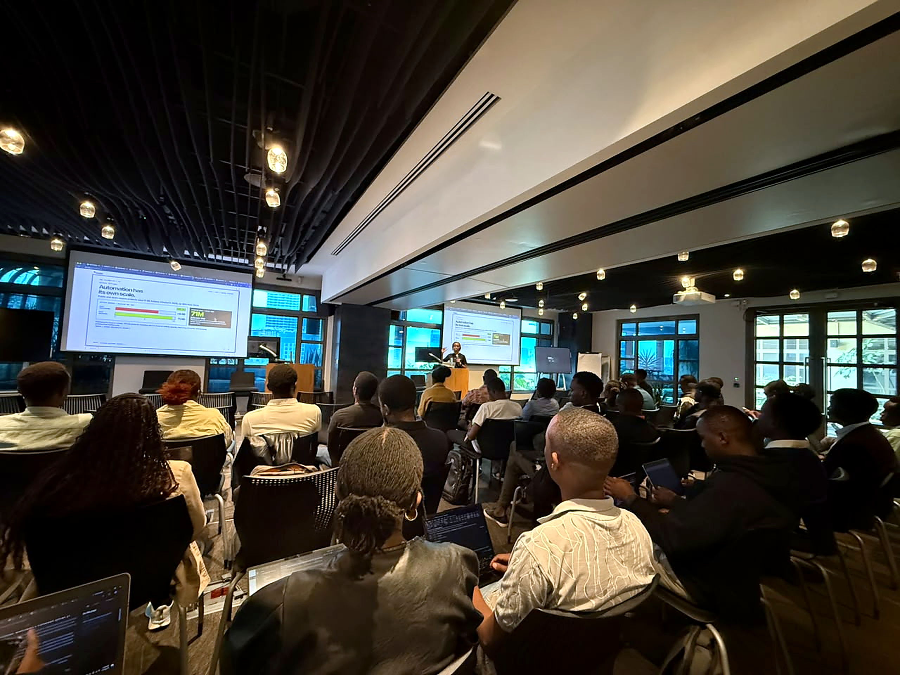
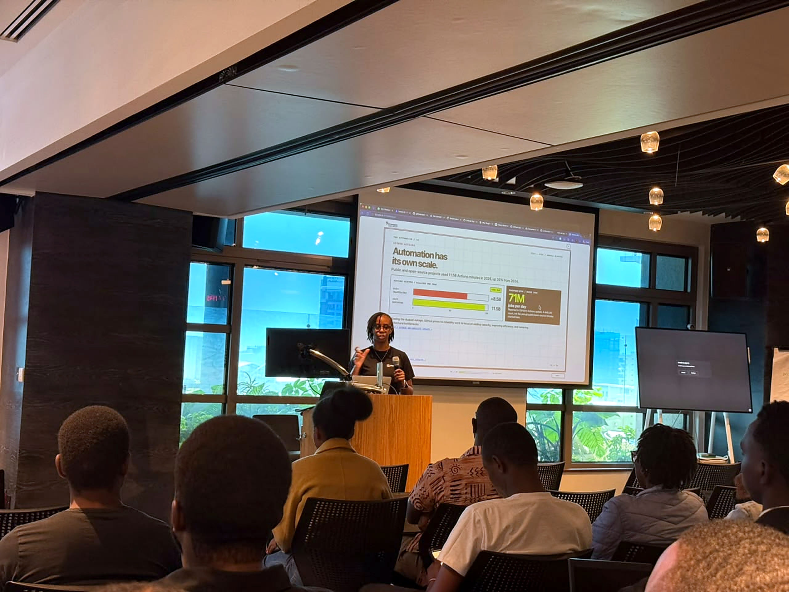

# The repository is the room.

- Event: [Dynamics User Group Kenya Meetup](https://www.meetup.com/microsoft-dynamics-365-kenya/events/316474644/)
- Date: September 25, 2026
- Venue: Microsoft ADC, Nairobi

This talk explores how developers and coding agents can work in parallel while GitHub keeps intent, evidence, and human decisions visible.

View the [interactive slides](https://juliawakiru.dev/dug-the-repository-is-the-room/#slide-1) or download the [PDF deck](slides.pdf).

|  |  |
| --- | --- |
|  |  |

## Resources

1. [Turn one giant AI-generated pull request to a reviewable stack](https://github.blog/engineering/turn-one-giant-ai-generated-pull-request-to-a-reviewable-stack/)
2. [GitHub Copilot app](https://gh.io/app)
3. [Integrating Copilot cloud agent with Slack](https://docs.github.com/en/copilot/how-tos/copilot-integrations/integrate-cloud-agent-with-slack)
4. [Integrating Copilot cloud agent with Teams](https://docs.github.com/en/copilot/how-tos/copilot-integrations/integrate-cloud-agent-with-teams)
